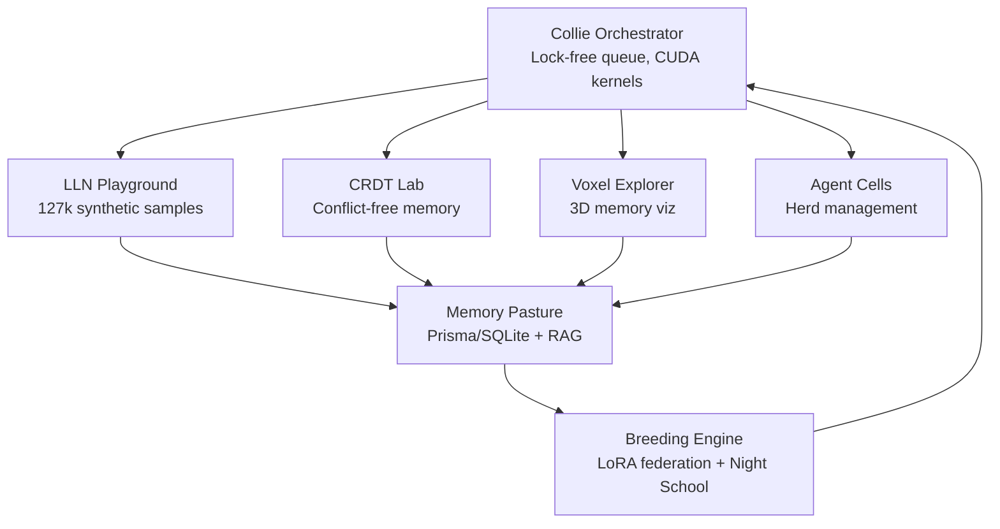
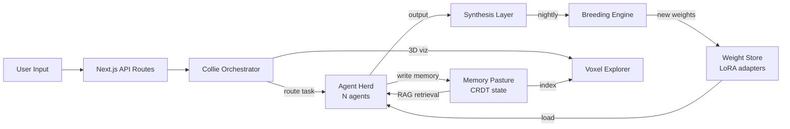

# SuperInstance Ranch

```
        ____
       /    \        ~ LLM Alpha ~   ~ LLM Beta ~   ~ LLM Gamma ~
      | o  o |            🐄               🐄               🐄
       \  __ /       ________________________________________________
        |    |      |                                                |
    /|  |    |  |\  |           M E M O R Y   P A S T U R E        |
   / |  |____|  | \ |________________________________________________|
  /  |   ||||   |  \           |           |           |
     |___|  |___|            breed       breed       breed
         \\//                  \           |           /
          \/                    \_________\|/_________/
     [ COLLIE ]                    BREEDING ENGINE
    ORCHESTRATOR  <-----------------------------------------
         |                                                  |
         |---> [ LLN Playground ] --> [ CRDT Lab ] -------->|
         |---> [ Agent Cells    ] --> [ Voxel Explorer ] -->|
         |---> [ Night School   ] --> [ Memory Pasture ] -->|
```

**A self-evolving AI Ranch on your $499 Jetson. Local LLM agents breed, debate, and synthesize knowledge while you sleep.**

[](https://github.com/SuperInstance/Lucineer/actions/workflows/ci.yml)
[](https://opensource.org/licenses/MIT)

---

## Quick Start

```bash
git clone https://github.com/SuperInstance/Lucineer && cd Lucineer
cp .env.example .env && bun install && bunx prisma db push
make run
```

Open http://localhost:3000 — your Ranch is live.

---

## Architecture



---

## Cloud vs Ranch

| Feature | Cloud GPT-4 | Jetson Ranch |
|---|---|---|
| Cost/month | $100–$500+ | $0 (after hardware) |
| Privacy | Your data on their servers | 100% local, air-gapped |
| Latency | 800ms–3s (network) | <50ms (local CUDA) |
| Agent scale | API rate-limited | 10k+ concurrent |
| Memory persistence | None (stateless) | CRDT pasture survives reboots |
| Offline | No | Yes, fully offline |
| Breeding/evolution | No | Nightly LoRA synthesis |
| Determinism | Non-deterministic | Geometric manifold snapping |

---

## Why This Exists

There is a utility curve for AI models: GPT-4 sits at the top of general capability but far right on the cost-privacy tradeoff. For most production workloads — internal knowledge, code review, document analysis, automation — a smaller model *trained on your data* running *on your hardware* beats a large generic model on every dimension except raw benchmark scores.

SuperInstance Ranch inverts the cloud model. Instead of renting intelligence, you breed it. Your agents learn your codebase, your domain vocabulary, your team's reasoning patterns. Every night they synthesize what they learned into tighter LoRA weights. After 30 days, you have something GPT-4 cannot replicate: a model that thinks like your organization.

---

## Features

### GPU Collie Orchestrator
Coordinates thousands of agents using a lock-free work queue with CUDA persistent kernels. The Collie routes tasks, manages agent lifecycles, and enforces herd topology — all without a central bottleneck. Scales from 1 to 10,000+ agents on a single Jetson.

### Geometric Breeding (LoRA)
Agents breed via LoRA weight federation. Two agents with complementary knowledge merge in latent space using KD-tree snapping to geometric manifold boundaries — ensuring the offspring stays within valid reasoning territory. Night School runs this at 2am so you wake up to evolved agents.

### Memory Pasture (CRDT + RAG)
Agent memory is stored as a CRDT (Conflict-free Replicated Data Type) — a mathematical structure that merges without conflicts even when multiple agents write simultaneously. The Pasture also indexes all memory for RAG (Retrieval Augmented Generation), giving agents instant access to the full knowledge corpus.

### LLN Playground (127k samples)
The Local Learning Network contains 127,000+ synthetic training samples for bootstrapping agent knowledge. Browse, filter, and augment the dataset directly from the web UI. Export fine-tuning datasets in JSONL format compatible with `torchtune` and `llama.cpp`.

### Voxel Memory Visualizer
3D visualization of your agents' memory pasture. Each voxel represents a knowledge cluster; color encodes recency, size encodes access frequency. Watch your herd's collective knowledge grow in real time.

### Night School (Nightly Evolution)
Configurable via `BREEDING_SCHEDULE` in `.env`. Default: 2am. Night School gathers agent performance logs, scores synthesis candidates, runs LoRA merges, validates offspring on held-out samples, and promotes winners to the active herd. Losers are composted into the Memory Pasture as training signal.

---

## Hardware Requirements

| Device | Price | VRAM | TDP | Notes |
|---|---|---|---|---|
| Jetson Orin Nano 8GB | $499 | 8GB unified | 20W | Recommended entry point |
| Jetson AGX Orin | $599+ | 64GB unified | 60W | Full production herd |
| Any Linux + CUDA GPU | Varies | 6GB+ | Varies | Works on RTX 3060+ |

Minimum: 8GB RAM, 4GB VRAM, Ubuntu 20.04+, CUDA 11.8+.

---

## Architecture Deep Dive



**Data flow:**
1. User submits a task via the web UI
2. Collie receives the task and routes it to the best-fit agent in the herd
3. The agent retrieves relevant memories from the Pasture via RAG
4. The agent produces output, which is written back to the CRDT Pasture
5. At night, the Breeding Engine scores agents by output quality and breeds top performers via LoRA merge
6. New LoRA adapters are validated and promoted; the herd wakes up smarter

---

## Install

### One-command (Jetson / Linux)

```bash
curl -sSL https://install.superinstance.ai | bash
```

Or clone and run locally:

```bash
bash scripts/install_jetson.sh
```

See `scripts/install_jetson.sh` for the full annotated installer.

### Manual

```bash
git clone https://github.com/SuperInstance/Lucineer && cd Lucineer
cp .env.example .env
# edit .env to set DATABASE_URL and RANCH_NAME
bun install
bunx prisma db push
make build
make start
```

---

## Makefile Targets

| Target | Description |
|---|---|
| `make help` | Print all targets (default) |
| `make install` | Run the Jetson installer |
| `make run` | Start development server |
| `make start` | Start production server |
| `make build` | Build for production |
| `make db-push` | Apply Prisma schema to DB |
| `make db-reset` | Reset and re-migrate DB |
| `make breed` | Trigger a manual breeding cycle |
| `make night-school` | Launch Night School (nightly evolution) |
| `make benchmark` | Run Ranch performance benchmarks |
| `make lint` | Lint the codebase |
| `make clean` | Remove build artifacts |

---

## Screenshots


---

## Research Foundations

| Concept | Description |
|---|---|
| **LoRA federation** | Low-Rank Adaptation enables merging fine-tuned model deltas without full retraining, making agent breeding computationally tractable on edge hardware. |
| **CRDT conflict-free state** | Conflict-free Replicated Data Types are mathematical structures that merge concurrent writes without coordination, making multi-agent shared memory correct by construction. |
| **Geometric manifolds** | Neural network weight space has curved geometry; valid reasoning configurations cluster on low-dimensional manifolds, and KD-tree snapping keeps bred offspring inside these valid regions. |
| **Evolutionary game theory** | Agent scoring uses replicator dynamics from evolutionary game theory — agents that produce higher-quality outputs reproduce more, driving population-level improvement over generations. |
| **Synthetic data distillation** | The LLN Playground uses teacher-model distillation to generate 127k+ synthetic samples that preserve reasoning traces, enabling sample-efficient fine-tuning on domain-specific tasks. |

---

## Contributing

1. Fork the repo
2. Create a feature branch: `git checkout -b feat/my-feature`
3. Run `make lint` before committing
4. Open a PR against `main`

See `docs/tutorials/` for architecture walkthroughs. See `examples/` for Ranch templates.

---

## License

MIT — see [LICENSE](LICENSE).

Copyright (c) 2024 SuperInstance
