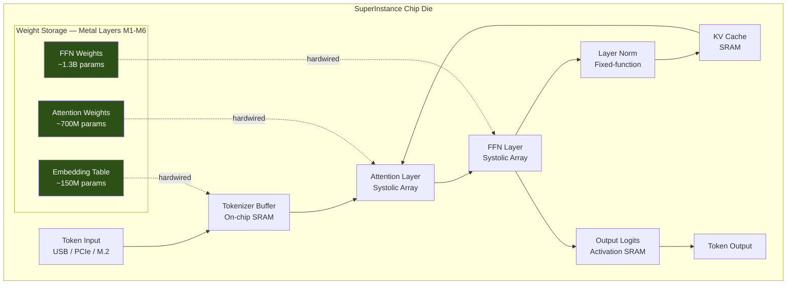
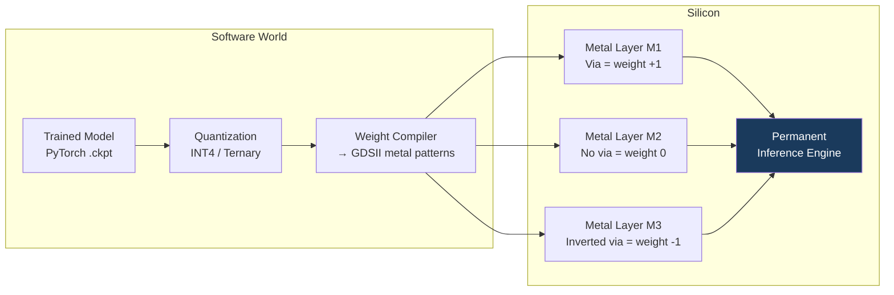
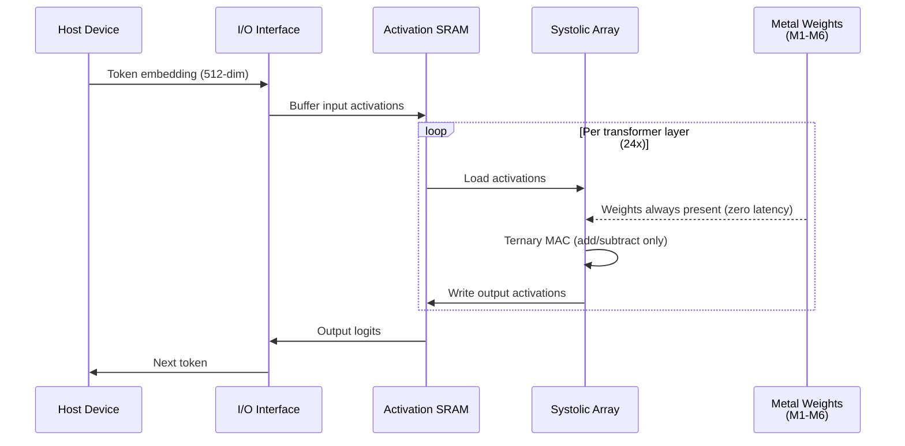
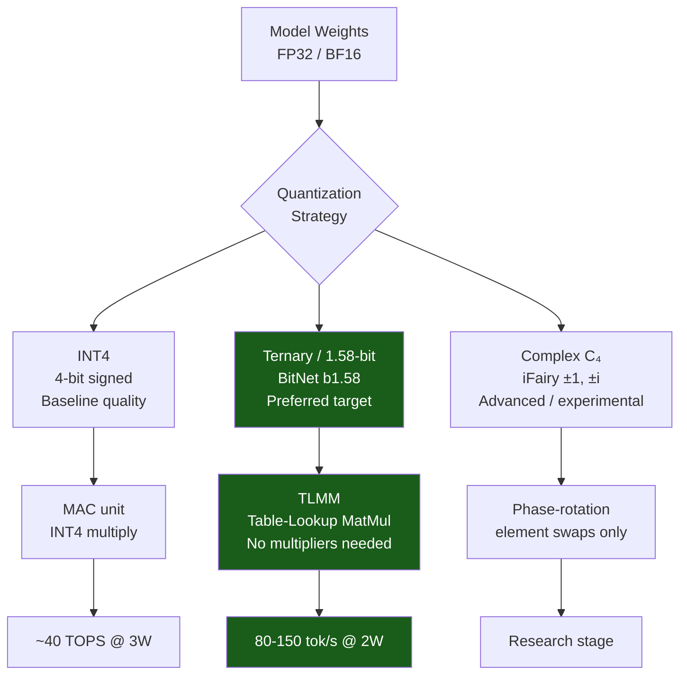
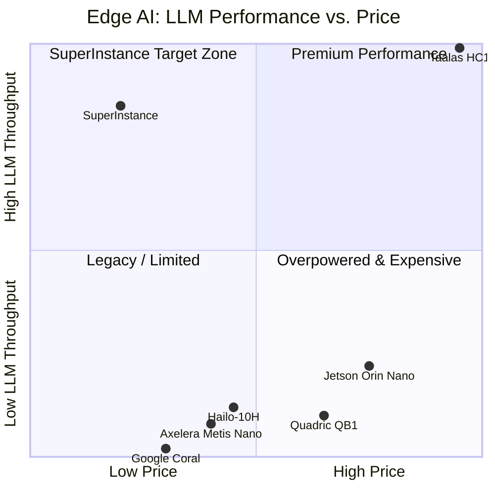
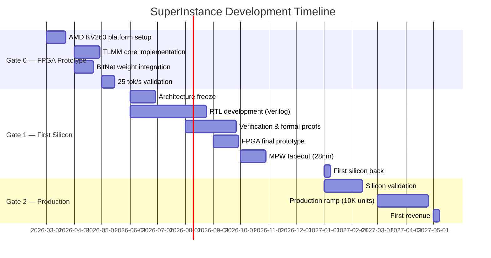
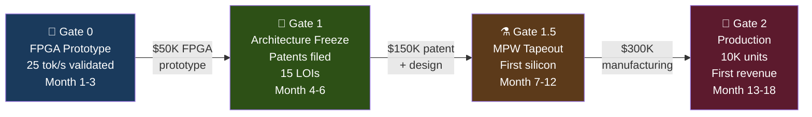
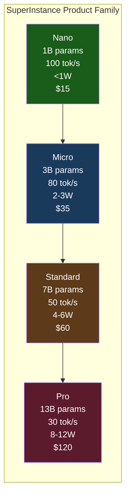
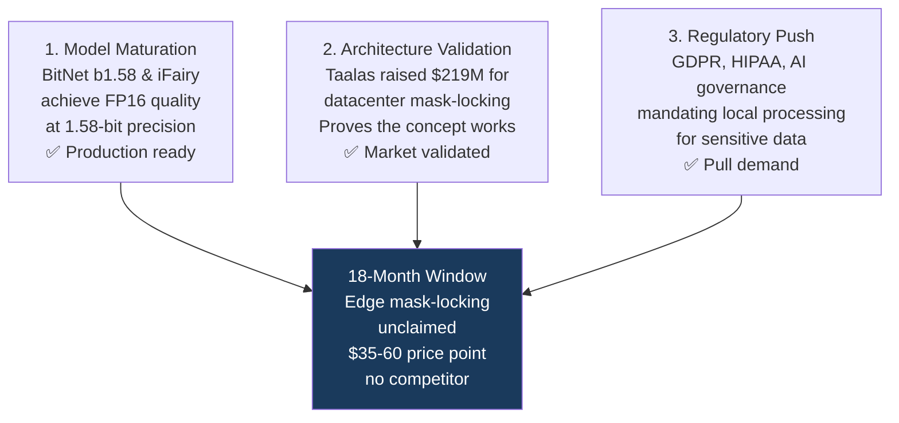

# Mask-Lock Inference Chip — SuperInstance

**Intelligence as a physical component, not a software service.**

SuperInstance is a **mask-locked AI inference chip** — neural network weights are encoded permanently into silicon metal interconnect layers at manufacture. No memory access. No drivers. No software stack. Plug in, get intelligence.

> "The Nintendo of AI. Different cartridges, different models. Same console."

---

## Who Should Read What

| You are | Start here |
|---|---|
| **Hardware / ASIC engineer** | [Architecture deep-dive](#architecture) → `docs/01-architecture.md` → `thermal_simulation/` |
| **ML / AI engineer** | [Quantization strategy](#quantization) → `docs/02-quantization.md` → `research/Ternary_Binary_Neural_Networks_Research_Report.md` |
| **Software developer** | [Developer quickstart](#developer-quickstart) → `ONBOARDING.md` → `src/app/` |
| **Investor / exec** | [Why now](#why-now) → `SuperInstance_Executive_Summary.md` → `docs/07-business-model.md` |
| **Researcher** | [Research index](#research-index) → `docs/` → `research/` |

---

## The Core Idea

Traditional AI chips **load weights from memory** at runtime. Memory access is the bottleneck:

```
Traditional NPU:
  DRAM → Bus → Compute unit    (latency + energy per weight access)

Mask-Locked Chip:
  Weight IS the metal layer → Compute unit    (zero access cost, always present)
```

The tradeoff: changing weights requires a new chip. For edge inference with stable models, this is an enormous win. You gain **zero memory bandwidth overhead, zero access latency, and 10–50x power efficiency** — in exchange for model flexibility you don't need.

---

## Architecture



### How Weight Encoding Works



### Chip Signal Flow (Per Token)



---

## Quantization

Ternary weights — `{-1, 0, +1}` — are the key to making mask-locking practical at scale.



**Why ternary?** When weights are `{-1, 0, +1}`, multiplication reduces to:
- `+1 → pass the activation through`
- `-1 → negate the activation`
- `0 → contribute nothing`

No multipliers. Just adders and sign-flips — exactly what metal interconnects are good at.

**BitNet b1.58-2B-4T** benchmarks:
| Platform | Speedup vs FP16 | Energy Reduction |
|---|---|---|
| x86 CPU | 2.37x – 6.17x | 71.9% – 82.2% |
| ARM CPU | 1.37x – 5.07x | 55.4% – 70.0% |
| **Mask-locked ASIC** | **10–50x (projected)** | **~90%** |

---

## Competitive Landscape



| Chip | Throughput | Power | Price | LLM Focus | Verdict |
|---|---|---|---|---|---|
| **SuperInstance** | **80-150 tok/s** | **2-3W** | **$35-60** | ✅ Primary | — |
| Hailo-10H | 5-10 tok/s | 5W | $70-90 | ⚠️ Partial | 10x slower, 2x price |
| Jetson Orin Nano | 20-30 tok/s | 10-15W | $249 | ⚠️ Flexible | 5-7x more power |
| Google Coral | <1 tok/s | <2W | $25-60 | ❌ None | No LLM |
| Taalas HC1 | 17,000 tok/s | 200W+ | API only | ✅ Data center | Different market |
| Axelera Metis Nano | Unknown | ~2W | $50-80 | ⚠️ Emerging | Not benchmarked |

**Taalas validates the approach.** They raised $219M for data center mask-locked chips (200W+, API pricing, 53B transistors). SuperInstance is the **edge version**: sub-$60, sub-5W, cartridge-swappable. Zero market overlap.

---

## Development Roadmap



### Gate Definitions



---

## Product Line



---

## Why Now

Three forces converge in 2026:



**Edge AI chip market**: $26B (2025) → $69B (2030). The sub-$100, sub-5W LLM segment is unclaimed.

---

## Research Index

| Document | What it covers |
|---|---|
| `docs/01-architecture.md` | Full chip architecture, systolic arrays, control logic |
| `docs/02-quantization.md` | Ternary/binary quantization, BitNet, iFairy, TOM accelerator |
| `docs/03-thermal-engineering.md` | FEA models, heat equation derivations, PDN analysis |
| `docs/04-competitive-landscape.md` | Taalas, Hailo, Jetson, Axelera, Groq, Etched deep-dives |
| `docs/05-ip-strategy.md` | Patent filings, FTO analysis, prior art gaps |
| `docs/06-fpga-prototype.md` | TLMM implementation, KV260 guide, 12-week plan |
| `docs/07-business-model.md` | Cost structure, pricing, exit analysis |
| `research/` | 20+ raw research cycles with Python simulations |
| `thermal_simulation/` | FEA thermal solver codebase |

---

## Developer Quickstart

```bash
# Clone
git clone https://github.com/SuperInstance/mask-lock-clips
cd mask-lock-clips

# Visualizations (Next.js)
npm install
npm run dev
# Open: http://localhost:3000/manufacturing  — chip manufacturing pipeline
# Open: http://localhost:3000/rtl-studio     — Verilog design flow
# Open: http://localhost:3000/specs          — ternary MAC comparisons
# Open: http://localhost:3000/timing-playground

# Thermal simulations (Python)
cd thermal_simulation
pip install numpy scipy matplotlib
python core_thermal.py          # FEA steady-state solver
python transient_thermal.py     # Transient thermal response
python geometry_optimization.py # Heat dissipation optimization

# Research simulations
cd research
python run_all_simulations.py   # All 20 research cycles
python cycle11_quantum_thermal.py  # Quantum thermal analysis
python cycle17_side_channel.py     # Side-channel security
```

---

## Key Numbers

| Metric | Value | Source |
|---|---|---|
| Target power | <3W inference | Architecture spec |
| Throughput | 80-150 tok/s | BitNet + TLMM projections |
| Process node | 28nm CMOS | NRE cost optimization |
| NRE cost | $2-4M | 28nm mask set + design |
| Unit cost @ 10K | $11-20 | Die + packaging + test |
| Target retail price | $35-60 | 50-60% gross margin |
| Model: BitNet b1.58-2B | 2.4B params, ternary | Microsoft Research |
| Taalas comparison | 200W vs 2-3W | Different markets |
| Seed ask | $500K | 18-month runway |

---

## Repository Layout

```
mask-lock-chip/
├── README.md                           ← You are here
├── ONBOARDING.md                       ← Start here as a new contributor
├── mask_locked_plan.txt                ← Complete developer plan (10 pages)
├── mask_locked_deep_dive.md            ← Full technical analysis
├── FPGA_Prototype_Implementation_Guide.md  ← Gate 0 FPGA plan
├── neuromorphic_architecture_report.md     ← Bio-inspired 28nm design
├── SuperInstance_Executive_Summary.md      ← Investor one-pager
├── SuperInstance_Investor_Pitch.md         ← Full pitch deck
│
├── docs/                               ← Synthesized research documentation
│   ├── 01-architecture.md
│   ├── 02-quantization.md
│   ├── 03-thermal-engineering.md
│   ├── 04-competitive-landscape.md
│   ├── 05-ip-strategy.md
│   ├── 06-fpga-prototype.md
│   └── 07-business-model.md
│
├── research/                           ← Raw research cycles (20+)
│   ├── cycle1_*.md / cycle1_*.py
│   ├── ...
│   ├── cycle20_competitive_dynamics.*
│   ├── Thermal_Dynamics_Mathematical_Framework.md
│   ├── Ternary_Binary_Neural_Networks_Research_Report.md
│   ├── Patent_IP_Strategy_DeepDive_Report.md
│   ├── Edge_AI_Chip_Competitive_Intelligence_Report_2026.md
│   └── twelve_round_framework/
│
├── thermal_simulation/                 ← Python FEA solvers
│   ├── core_thermal.py
│   ├── transient_thermal.py
│   ├── geometry_optimization.py
│   ├── mac_array.py
│   ├── spine_geometry.py
│   ├── biological_thermal.py
│   └── materials.py
│
├── download/                           ← Execution plans, research packages
│   ├── Mask_Locked_Chip_Execution_Plan_v5_Verified.pdf
│   ├── Investment_Memorandum_v2.docx
│   └── DeepResearch_*.md
│
├── final_delivery/                     ← Consolidated deliverables
│   ├── core_documents/
│   ├── production/
│   ├── reviews/
│   └── supporting_research/
│
└── src/app/                            ← Interactive visualizations (Next.js)
    ├── manufacturing/                  ← Chip manufacturing pipeline
    ├── rtl-studio/                     ← RTL → GDSII design flow
    ├── specs/                          ← Ternary MAC comparisons
    ├── timing-playground/              ← Circuit timing analysis
    ├── cell-builder/                   ← Logic gate / cell editor
    ├── voxel-explorer/                 ← 3D chip cross-sections
    ├── math-universe/                  ← Mathematical foundations
    ├── economics/                      ← Cost modeling
    └── professional/                   ← Team & career info
```

---

## Academic Foundations

- **Hardwired-Neurons LPU** — arXiv:2508.16151 — Foundational paper validating mask-locked approach (41-80x cost-effectiveness vs H100)
- **BitNet b1.58** — arXiv:2402.17764 — Ternary weights matching FP16 quality
- **TeLLMe / TLMM** — arXiv:2510.15926 — Table-lookup MatMul for FPGA ternary inference
- **iFairy / Fairy±i** — arXiv:2508.05571 — Complex-valued 2-bit LLM (multiplication-free)
- **TOM Accelerator** — arXiv:2602.20662 — Ternary ROM-SRAM hybrid, 3,306 TPS on BitNet-2B

---

*SuperInstance — Physical AI, Collectible Intelligence*
